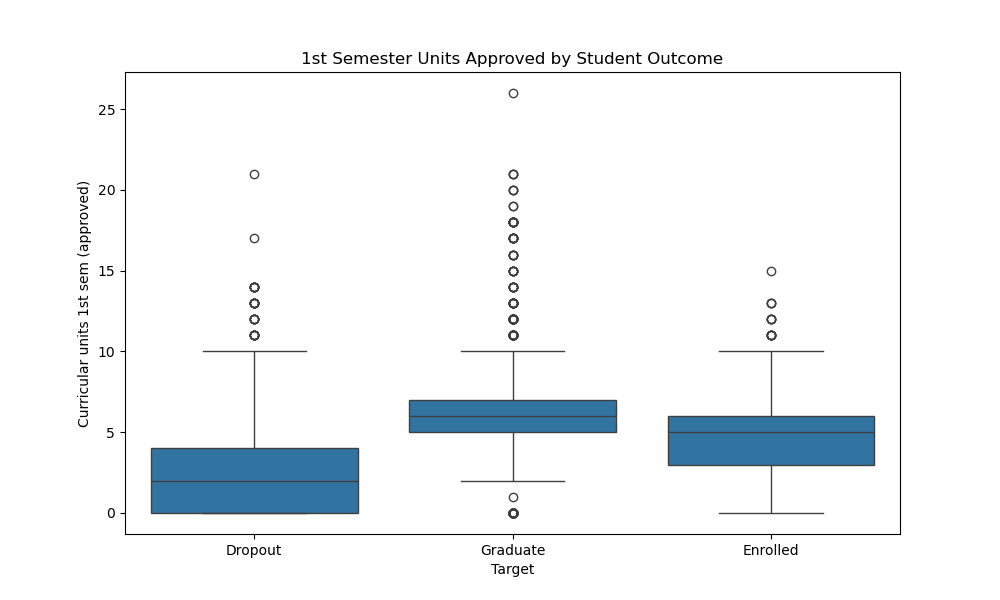
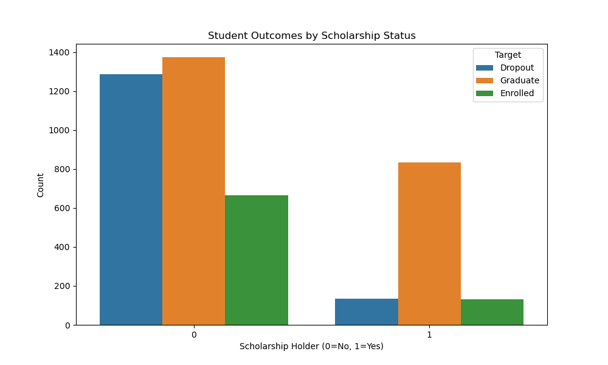

## Introduction

So as we all know higher education is a powerful gateway that unlocks opportunities for all people. However, not everyone is able to finish their educational goals and some outright fail out. 
In this analysis, we will be looking at the factors that could contribute to student dropout and what makes certain students succeed.

## Research Questions

1. **Prior Academic Performance:**  
   What is the relationship between a student's previous qualification grade or admission grade and their likelihood of dropping out or graduating?

2. **First-Semester Engagement:**  
   How does a student's engagement in the first semester (number of curricular units enrolled, approved, and grades) predict their final outcome?

3. **Socioeconomic Factors:**  
   How do scholarship status, tuition fee status, and parental education/occupation influence student dropout rates and academic success?

---

## The Dataset

The data comes from **UCI’s Machine Learning Repository**:  
[Predict Students' Dropout and Academic Success](https://archive.ics.uci.edu/ml/datasets/Predict+Students'+Dropout+and+Academic+Success).  

- **Size:** 4,424 student records  
- **Features:** 36 attributes related to enrollment, demographics, socioeconomic factors, and performance  
- **Key Features:** GDPR, tuition status, scholarship holder, previous qualification grade, age at enrollment  
- **Target Variable:** Categorizes students into **Dropout**, **Enrolled**, or **Graduate**

---

## Data Preprocessing

- No missing or null values were found.  
- Most features were numeric, with the exception of the target variable (categorical).

Initially, the dataset failed to load correctly because it uses semicolons (;) as delimiters instead of the standard comma. 
So I implemented a check to detect this and correctly parse the 36 columns. 
I also verified that there were no missing values or duplicate records to ensure data integrity.

---

## Visualizations

---

## Storytelling

Contrary to the common belief that high school performance is the best predictor of college success, the analysis reveals a more complex picture.  

The box plot shows that while graduates have a slightly higher median admission grade, the distributions for Dropouts and Graduates overlap significantly.  
For example, a student with a grade of **120** could end up in either category.

This highlights that many factors beyond academics (e.g., financial challenges, motivation, and personal connections) can influence student outcomes.

First-Semester Engagement:
The analysis of first-semester performance shows a clear distinction. 
Students who approved more curricular units in their first semester were significantly more likely to graduate. Dropouts, on average, approved far fewer units, suggesting that early academic struggles are a strong warning sign.

Socioeconomic Factors:
The scholarship data reveals a crucial insight. A higher proportion of scholarship holders are in the 'Graduate' category compared to the 'Dropout' category. 
This suggests that financial support may play a vital role in student retention, allowing them to focus more on their studies.

---

## Impact

This changes how we should think about helping students. 
To truly ensure that students are gaining the education they deserve, we need to find things out like: Are they engaged in class? Do they have substantial debt? 
The goal is to catch students who are struggling for any reason, not just an academic one.

Potential Harm:
If this model were used blindly to flag "at-risk" students, it could lead to stigmatization or unfair profiling. 
For example, students from lower socioeconomic backgrounds might be flagged as "likely to drop out" before they even start, potentially leading to bias in how they are treated by faculty.

Missing Perspectives:
The dataset is purely quantitative. We are missing the student's individual voice. ualitative data on why they dropped out (e.g., mental health, family emergencies, or lack of belonging) which numbers alone cannot capture.

## References
Realinho, V., Machado, J., Baptista, L., & Martins, M. (2021). Predict Students' Dropout and Academic Success. UCI Machine Learning Repository. 

[Link to Notebook](Project1\Project1.ipynb)