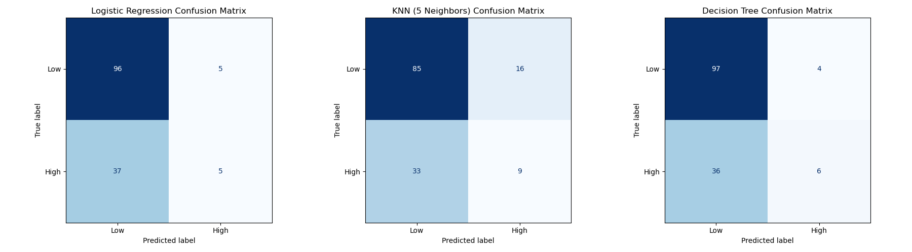

# Project 2: Predicting High Doctor Visits

## Introduce the Problem
This project looks at whether a patient will have a **high number of doctor visits** (here, 4 or more per year) based on their health and basic demographic information. In other words, it is a classification problem: the goal is to separate people into "high" and "low" doctor-visit groups so we can get a better sense of who might need more care.

In simple terms, the main questions are:
* Which patients are most likely to end up in the **high‑visits** group?
* Which health, sleep, or background features seem most connected to frequent doctor visits?

## Introduce the Data
The dataset used is the **NPHA Doctor Visits** dataset. It includes information about patients' physical health, mental health, dental health, and some basic socioeconomic factors.
*   **Source:** NPHA Doctor Visits Dataset
*   **Key Features:**
    *   `Phy_Health`: Physical health rating.
    *   `Men_Health`: Mental health rating.
    *   `Age`: Age category.
    *   `Stress`: Stress levels.

## Pre-processing the Data
1.  **Renaming Columns:** Spaces were removed from column names so they are easier to work with in code.
2.  **Target Variable Creation:** The original `Number_of_Doctors_Visits` column was a number that could take many values. It was turned into a yes/no style target so we could focus on "High Usage":
    *   **0 (Low Visits):** Less than 4 visits.
    *   **1 (High Visits):** 4 or more visits.
3.  **Scaling:** `StandardScaler` was used to put all numeric features on a similar scale. This helps models like KNN and Logistic Regression, which are sensitive to differences in feature size (for example, Age versus Stress Level).
4.  **Trouble Sleeping Feature:** The dataset documentation says the "Trouble Sleeping" feature should be coded as 0 = No and 1 = Yes, but in the actual data this column sometimes takes values higher than 1 (for example, 2 or 3), which looks more like different levels of trouble sleeping. To keep things simple and closer to the documentation, a new yes/no column `Trouble_Sleeping_Binary` was created: 0 means no trouble sleeping, and any value above 0 is treated as "has trouble sleeping." This makes the model easier to work with, but it does lose some detail about how severe the sleep problems are.

## Data Understanding & Modeling
Before picking a "best" model, the data was explored using basic summaries and then, later on, confusion matrices and feature‑importance plots. These helped show which features were actually driving predictions and where the models were messing up (for example, missing people who really were high‑visit patients). That feedback loop guided which features to keep and which models to trust more.

Three different models were tried for this classification problem:

1.  **Logistic Regression:** A simple linear model that tries to draw a straight line between the "high" and "low" groups. It is easy to interpret (you can look directly at the coefficients) but can miss more complicated, non‑linear patterns.
2.  **K-Nearest Neighbors (KNN):** For a new patient, this model looks at the most similar patients in the training set and uses their labels to make a prediction. It is very intuitive, but it can be slower on larger datasets and is sensitive to how the features are scaled.
3.  **Decision Tree:** This model builds a flowchart of yes/no questions (for example, "Is Physical_Health <= 3?") to split the data. It can capture non‑linear relationships and interactions between features, but it can also overfit if the tree is allowed to grow too deep (so a max depth was set).

### Model Performance
*   **Logistic Regression Accuracy:** 0.706
*   **KNN Accuracy:** 0.657
*   **Decision Tree Accuracy:** 0.720

Accuracy was used as the main metric here because, after choosing a cutoff for "High Visits," the classes ended up reasonably balanced. The confusion matrices are helpful for seeing **how** the models are wrong, not just how often they are right—for example, whether they are more likely to miss high‑visit patients (false negatives) or to flag too many low‑visit patients as high (false positives).

## Storytelling & Insights
Looking at the feature importance plots, **Physical Health (`Physical_Health`)** clearly stands out as the strongest signal across both models. **Mental Health (`Mental_Health`)** also shows up as important, especially in the decision tree, which tends to split on those two first.

The models also pick up on a few other patterns:
*   People with more problems related to sleep (for example, bathroom needs or pain keeping them up) tend to be more likely to land in the high-visits group.
*   Employment status and race show up with non‑zero importance too, which hints that work and background may also play some role in how often someone goes to the doctor.

Overall, this still points toward the idea that worse physical and mental health go hand in hand with more frequent doctor visits, and that sleep issues and some socioeconomic factors (like work status) are also part of the story.

## Impact Section
*   **Resource Allocation:** If a model like this works well, it could help clinics and hospitals plan staff and resources around people who are more likely to visit often.
*   **Potential Harm:** If used in the wrong way (for example, by an insurance company), this kind of model could be used to unfairly raise prices or limit options for people who already have health problems or high stress.
*   **Missing Perspectives:** The dataset does not include detailed medical history or any deeper background information. It is based on self-reported scores, which can be biased (for example, someone might under-report their stress or sleep problems), so the picture is not complete.

## References
1. University of Michigan. *National Poll on Healthy Aging (NPHA) – Doctor Visits*. UCI Machine Learning Repository. https://archive.ics.uci.edu/dataset/936/national+poll+on+healthy+aging+(npha)

## Code
[Link to Project 2 Notebook](https://github.com/adampang27/adampang27.github.io/blob/main/Project2/Project2.ipynb)