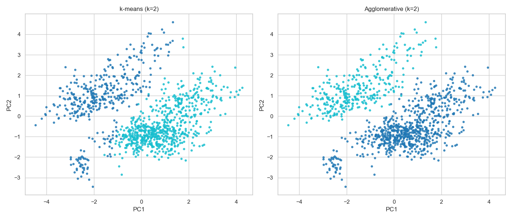

# Project 4: Clustering Cat Breeds

## Introduce the Problem
Cats are one of the most popular pets in the world, but how different are they really? In this project, I use clustering to see how cats group together based on their physical traits, daily routines, and where they live.

Rather than assuming that breed alone tells the whole story, I wanted to see what patterns actually show up in the data. In particular, I was curious whether groups would form more around breed labels or around other factors like body size, activity, or location.

## What is Clustering and How Does It Work?
Clustering is a way of grouping data points so that items in the same group/cluster are more similar to each other than to those in other groups. For this project, I used two different methods:

1.  K-Means Clustering: This algorithm tries to find k center points (centroids) and assigns every cat to the nearest center. It keeps moving the centers until the groups are stable. It works best when clusters are round and roughly the same size.
2.  Agglomerative Clustering: This is approach starts up from the bottom. It starts by treating every single cat as its own cluster and then keeps merging the two most similar clusters until we reach the desired number of groups. It builds a hierarchy like a family tree.

To decide which method and how many clusters were best, I looked at metrics like the Silhouette Score (how distinct the clusters are) and the Davies–Bouldin Index (how well-separated they are).

## Introduce the Data
The dataset used for this analysis is `cat_breeds_clean.csv`. It contains information about various cat breeds, including their physical stats and daily lives.

*   **Source:** Provided course dataset (`cat_breeds_clean.csv`).
*   **Key Features:**
    *   **Physical:** `Body_length`, `Weight`, `Fur_colour_dominant`, `Eye_colour`.
    *   **Lifestyle:** `Allowed_outdoor`, `Owner_play_time_minutes`, `Sleep_time_hours`.
    *   **Demographics:** `Breed`, `Age_in_years`, `Gender`, `Country`.

## Data Understanding / Visualization
*   Checked for missing values and basic data types.
*   Plotted histograms for key numeric features like `Owner_play_time_minutes` and `Sleep_time_hours`.
*   Looked at latitude and longitude to see whether location might matter.

## Pre-processing the Data
To prepare the data for clustering, I did the following:

1.  Converted `Neutered_or_spayed` and `Allowed_outdoor` from text ("TRUE"/"FALSE") to boolean values.
2.  One-hot encoded the categorical columns so the models could work with them.
3.  Standardized the numeric features (for example, `Owner_play_time_minutes` and `Age_in_years`) with `StandardScaler`.
4.  Dropped `Age_in_months` because it carries the same information as `Age_in_years`.

## Modeling (Clustering)
I tried 2–6 clusters and, for each value of k, ran **K-Means** and then **Agglomerative Clustering**, comparing them with the Silhouette Score, Davies–Bouldin Index, and the Adjusted Rand Index (ARI) against the breed labels (as an external check).

### Model Performance
*   **Best k:** 2
*   **Silhouette Score:** 0.179
*   **Davies-Bouldin Index:** 2.146
*   **Adjusted Rand Index (K-Means):** 0.014
*   **Adjusted Rand Index (Agglomerative):** 0.027

The low ARI scores suggest that the natural clusters found by the algorithms do **not** align well with the breed labels. This means the cats are grouping based on other traits (like geography or size) rather than just their breed.

## Storytelling (Cluster Analysis)
After forming the clusters, I analyzed the "profiles" of each group to see what made them unique.
*   **Cluster Profiles:** I looked at the average weight, play time, and sleep time for each cluster.
*   **Visualizing Separation:** I used **PCA (Principal Component Analysis)** to combine the data down to 2 dimensions so I could plot it. This helped me see if the clusters were well-separated or if they overlapped a lot.

**Insights:**
The analysis revealed two main clusters that seem to be driven largely by **geography** and **size**:

*   **Cluster 0:**
    *   **Location:** Average Latitude ~48.85, Longitude ~-12.62 (Europe/France region).
    *   **Physique:** Smaller cats (Avg Body Length: 36.4 cm, Weight: 4.2 kg).
    *   **Age:** Younger on average (~2.8 years).
    *   **Lifestyle:** Slightly higher play time (26.7 mins).

*   **Cluster 1:**
    *   **Location:** Average Latitude ~41.90, Longitude ~-87.63 (USA/Chicago region).
    *   **Physique:** Larger cats (Avg Body Length: 48.4 cm, Weight: 6.2 kg).
    *   **Age:** Older on average (~6.0 years).
    *   **Lifestyle:** Slightly lower play time (21.0 mins).

    Overall, the clusters differed more by **location** and **size** than by things like coat pattern or indoor/outdoor status. Cats from the European locations in this dataset were generally smaller and younger, while the U.S. cats were larger and older, which helps explain why the clusters did not line up neatly with the breed labels.

## Impact Section
*   **Potential Benefits:** Even though the clusters mainly separate cats by location and size (smaller, younger European cats vs. larger, older U.S. cats), this still shows how environment and basic care patterns can shape groups. In a broader setting, similar analyses could help shelters or vets think about how housing, region, or body size relate to activity and care needs, instead of relying only on breed labels.
*   **Potential Harm:** The low ARI scores and the strong geographic signal mean these clusters are a rough pattern in this dataset, not fixed "types" of cats. Treating them as hard categories (for example, assuming all big U.S. cats are lazy or all smaller European cats are the same) could encourage oversimplified or unfair assumptions.
*   **Missing Perspectives:** The data only covers a few breeds and countries, and it focuses on simple measurements and owner-reported behavior. Important things like health history, more detailed behavior, and different regions are missing, so the location/size split I found should not be generalized too far beyond this dataset.

## References
*   Scikit-learn Documentation: [Clustering](https://scikit-learn.org/stable/modules/clustering.html)
*   Seaborn Documentation: [Visualizations](https://seaborn.pydata.org/)
*   JoannaN_PL_KRK. "It's Raining Cats" dataset. Kaggle. https://www.kaggle.com/datasets/joannanplkrk/its-raining-cats

## Code
[Link to Project 4 Notebook](https://github.com/adampang27/adampang27.github.io/blob/main/Project4/Project4.ipynb)
